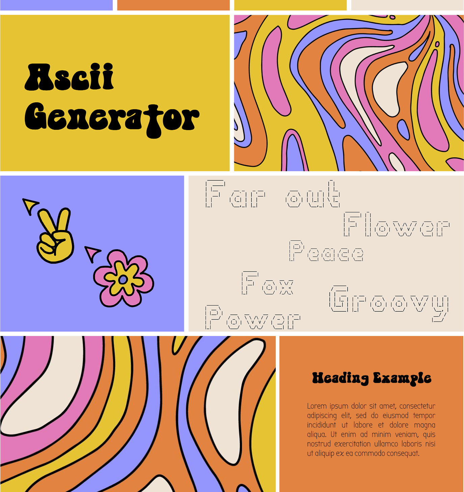

# ASCII Art Web



## Overview

ASCII Art Web is a web application that converts text into ASCII art with various stylistic options. The project features a groovy, 70s-inspired design with an interactive and user-friendly interface, complete with custom cursors for a unique user experience.

## Features

- **Text to ASCII Art Conversion**: Transform your text into ASCII art
- **Multiple Font Styles**: Choose from different ASCII art fonts including:
  - Standard
  - Shadow
  - Thinkertoy
- **Interactive UI Elements**:
  - Custom flower cursor for general navigation
  - Custom pointer cursor for interactive elements
  - Groovy 70s-inspired design
  - Hover effects and transitions
- **Export Functionality**: Save your ASCII art creations
- **Error Handling**: User-friendly error messages with custom styled popups

## Technologies Used

- **Backend**: Go (Golang)
- **Frontend**: 
  - HTML5
  - CSS3
  - JavaScript
- **Custom Design Elements**:
  - Sooky70s font for headings
  - Bubble font for general text
  - Custom flower cursor for navigation
  - Custom pointer cursor for clickable elements
  - 70s-themed color palette

## Getting Started

### Prerequisites

- Go 1.16 or higher

### Installation

1. Clone the repository:
   ```
   git clone https://github.com/bytebabee/ascii-art-web.git
   ```

2. Navigate to the project directory:
   ```
   cd ascii-art-web
   ```

3. Run the application:
   ```
   go run main.go
   ```

4. Open your browser and visit `http://localhost:8080`

## Usage

1. Enter your text in the input field
2. Select your desired ASCII art style from the dropdown menu
3. Click "Generate" to create your ASCII art
4. Use the export button to save your creation
5. Use the refresh button to start over

## Project Structure

- `main.go`: Entry point of the application
- `templates/`: HTML templates
  - `index.html`: Main page template
  - `404.html`: Custom 404 error page
- `static/`: Static assets
  - `style.css`: Main stylesheet
  - `images/`: Contains background, cursors, and icons
    - `flower.svg`: Custom navigation cursor
    - `pointer.svg`: Custom button cursor
    - `background.jpg`: 70s-themed background
  - `fonts/`: Custom fonts
    - `Sooky70s.ttf`: Main heading font
    - `Bubble.ttf`: Body text font
- `handlers/`: Request handlers
- `ascii/`: ASCII art generation logic

## Authors

- Created by Irem ([@bytebabee](https://github.com/bytebabee)) and Taha ([@tcavuslu](https://github.com/tcavuslu)) 